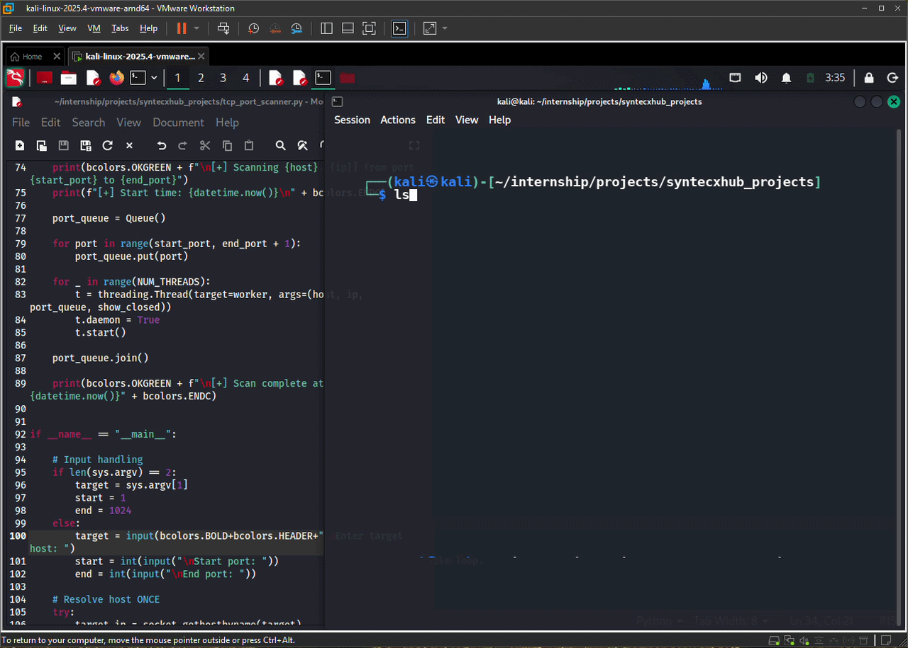

# 🚀 Syntecxhub Port Scanner

A fast, lightweight **TCP Port Scanner** built in Python. Maps open ports on any target host by scanning a user-defined port range using concurrent threads for maximum speed.

---

## 📌 Overview

This tool performs TCP connect scans to identify open ports on a given host. Built with Python's `socket` and `threading` libraries, it efficiently scans large port ranges and logs results in real time.

### Key Objectives

- **TCP port scanning** — checks open/closed/timeout status for every port in range
- **Concurrent scanning** — uses threads for fast, parallel port checks
- **Flexible input** — scan a single port or a full range with custom start/end values
- **Result logging** — prints and logs open ports with exception handling for timeouts and errors

---

## 🔐 How It Works

```
User Input (host + port range)
        │
        ▼
  Socket Connection Attempt (TCP)
        │
    ┌───┴───┐
  Open    Closed / Timeout
    │
    ▼
 Log & Print Result
```

Each port is tested by attempting a TCP handshake. If the connection succeeds, the port is marked **open**. Refused or timed-out connections are marked **closed** or **filtered**.

---

## 🛠️ Installation & Usage

### 1. Clone the repository

```bash
git clone https://github.com/Cyb3Raiz000/Syntecxhub_PortScanner.git
```

### 2. Navigate to the project folder

```bash
cd Syntecxhub_PortScanner
```

### 3. Run the scanner

```bash
python tcp_port_scanner.py
```

---

## 📸 Demo

<div align="center">
  
  <p><b>Figure: Port Scanner in action</b></p>
</div>

---

## 📁 Project Structure

```
Syntecxhub_PortScanner/
├── tcp_port_scanner.py   # Main scanner script
├── assets/
│   └── syntecxhub_network_map.gif  # Demo GIF
└── README.md
```

---

## ⚙️ Requirements

- Python 3.7+
- No third-party libraries required — uses Python standard library only (`socket`, `threading`)

---

## ⚠️ Disclaimer

This tool is intended for **authorized and educational use only**. Scanning ports on systems you do not own or have explicit permission to test may be **illegal** in your jurisdiction. Always obtain proper authorization before scanning any host.

---

## 📄 License

MIT License — free to use, modify, and distribute.

---

## 👤 Author

**Cyb3Raiz000**  
Built with Python Scanner · TCP Sockets · Threading - logging
